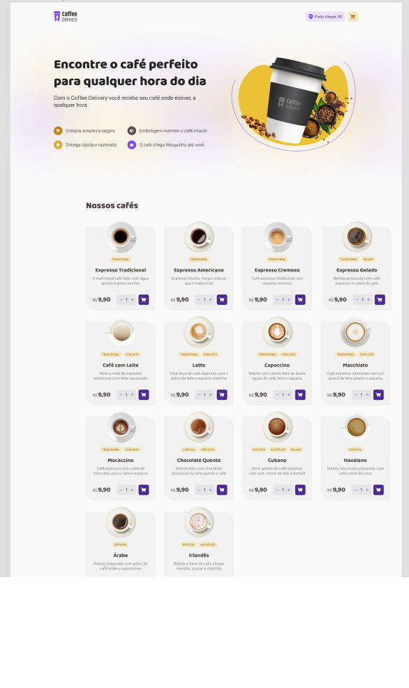
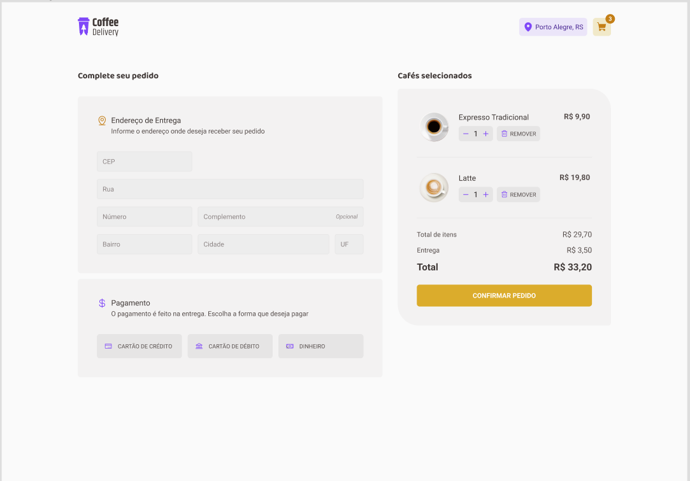
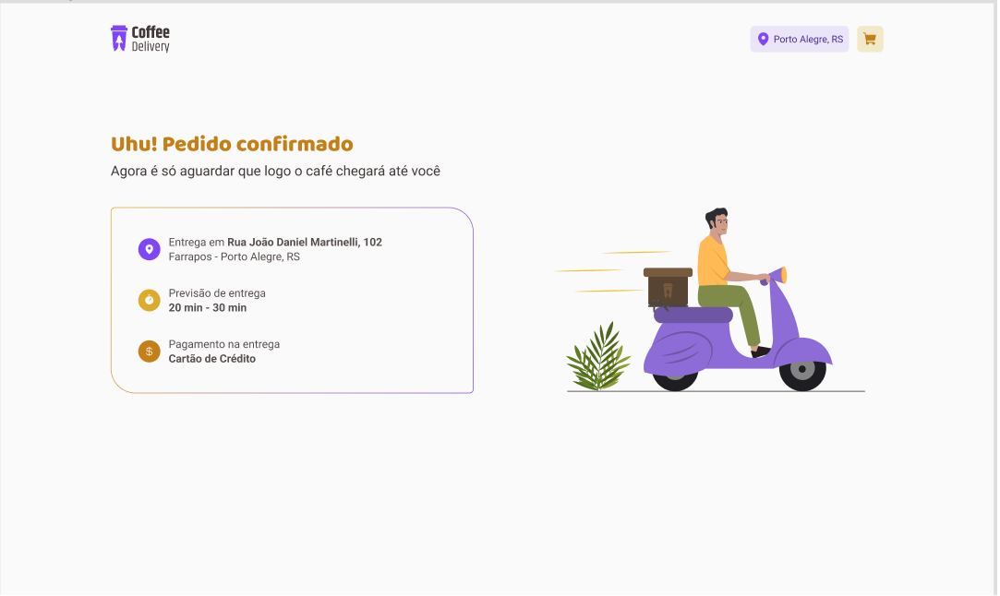

# Café Delicioso - Aplicativo de Venda de Cafés

O Café Delicioso é um aplicativo móvel que permite aos usuários encomendar uma variedade de cafés deliciosos e recebê-los diretamente em suas portas. Com uma interface intuitiva e recursos convenientes, o aplicativo torna a experiência de compra de café rápida, fácil e prazerosa.

## Recursos Principais

- **Explorar o Menu:** Os usuários podem navegar por uma ampla seleção de cafés, incluindo expressos, cappuccinos, lattes e muito mais. Cada item do menu possui uma descrição detalhada, incluindo os ingredientes utilizados e o perfil de sabor.

- **Personalização:** Os usuários têm a opção de personalizar seus cafés de acordo com suas preferências individuais. Eles podem escolher o tipo de leite, adicionar xaropes ou especiarias extras e ajustar a quantidade de café ou de açúcar.

- **Carrinho de Compras:** Os usuários podem adicionar itens ao carrinho de compras, visualizar um resumo dos itens selecionados, ajustar as quantidades e remover itens, se necessário.

- **Pagamento Seguro:** O aplicativo oferece opções de pagamento seguras e convenientes. Os usuários podem vincular seus cartões de crédito ou utilizar métodos de pagamento online populares para concluir suas transações.

## Capturas de Tela

## Instalação

1. Faça o download do aplicativo Café Delicioso da loja de aplicativos.
2. Instale o aplicativo em seu dispositivo móvel.
3. Comece a explorar o menu e faça seu primeiro pedido!

## Tecnologias Utilizadas

- Linguagem de Programação: React
- Ambiente de Desenvolvimento: Xcode
- Frameworks Utilizados: React, Node, TypeScript

## Contribuição

O Café Delicioso é um projeto em constante evolução. Se você gostaria de contribuir para o desenvolvimento do aplicativo, sinta-se à vontade para abrir uma issue ou enviar um pull request para análise.

## Equipe

- WesleyEpeneto - Desenvolvedor 
